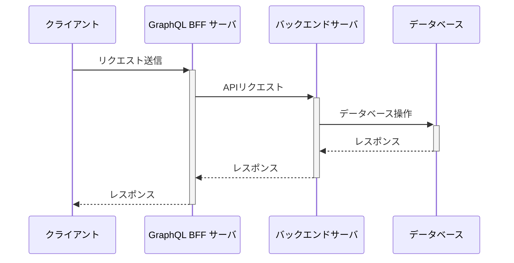
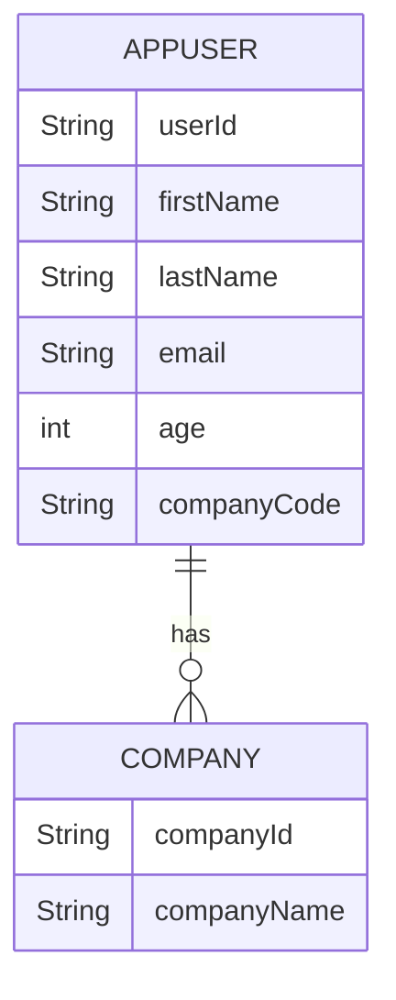
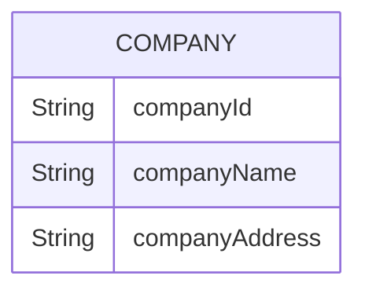
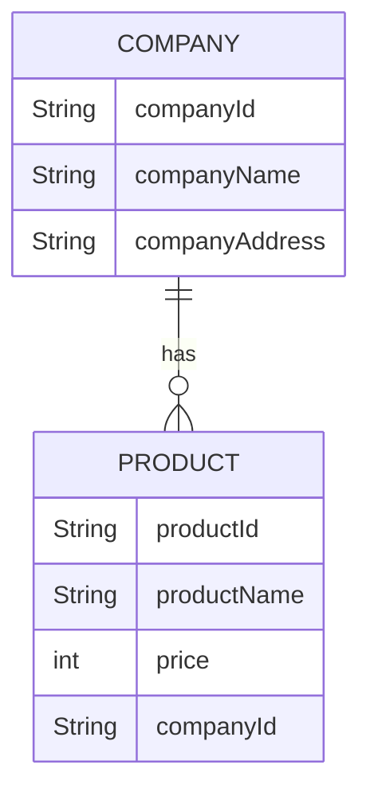

# BFF + BACKEND

# 環境構築

[前提となる環境構築](../00.環境構築/README.md)が完了している前提

## BFF

1. 依存関係のインストール

```sh
# リポジトリルートから
cd 03.bff+backend/bff
nvm use # .npmrc
corepack enable pnpm
pnpm -v # 9.4.0
pnpm i
```

2. バックエンドのプロキシコード生成
   </br>
   **※ 事前にバックエンドサーバーの起動が必要です。**

```sh
# リポジトリルートから
cd 03.bff+backend/backend
# 別ターミナルでバックエンドのサーバを起動している状態で(起動方法は以下参照)
./gradlew openApiClean openApiGenerate
```

## バックエンド

前提の環境構築が完了していれば特になし。

# サーバ起動

## BFF

```sh
# リポジトリルートから
cd 03.bff+backend/bff
pnpm start:dev
```

## バックエンド

```sh
cd 03.bff+backend/backend
./gradlew bootRun
```

# 前提情報

## システム構成/API リクエストシーケンス

localhost:3000 に BFF サーバ、localhost:8080 にバックエンドサーバがアップしており、以下のシーケンスでリクエストをします。



## 各エンドポイントの状況

### BFF

`http://localhost:3000/graphql`をブラウザで開くことでクエリのエディタが表示されます。

`http://localhost:3000/graphql-view`にアクセスすることでビジュアルにノード間の関係性を確認できます。

### バックエンド

`http://localhost:8080/swagger-ui/index.html#/`にアクセスすることでバックエンドの各エンドポイント情報を確認できます。

# NestJS 補足情報

## NestJS とは

JavaScript のサーバサイドフレームワークのことです。JavaScript の SpringBoot みたいなもの。

## NestJS で GraphQL をやる

NestJS で GraphQL をやるとき、GraphQL の登場人物（Schema/Resolver）が「クラス」と「アノテーション」で表現されます。

例えば、以下のような GraphQL のスキーマは

```gql
type User {
  id: String!
  name: String!
  company: Company!
}
```

以下のように書くことで実装できます(`bff/src/graphql/user/models/user.model.ts`)。

```ts
import { Field, ObjectType } from "@nestjs/graphql";
import { Company } from "src/graphql/company/models/company.model";

@ObjectType() // GraphQLのtypeであることを表現するアノテーション
export class User {
  @Field(() => String) // クラス内の各プロパティのGraphQLでのマッピング(id: String!)と対応する。
  id: number;
  @Field(() => String)
  name: string;
  @Field(() => Company)
  company: Company;
}
```

リゾルバーは以下のようになります。

例えば、以下のようなクエリ・ミューテーションがあるとき、

```gql
type Query {
  users(page: Int, size: Int, sort: [String!]): [User!]!
}

type Mutation {
  createUser(user: CreateUserInput!): User!
}

input CreateUserInput {
  id: String!
  firstName: String!
  lastName: String!
  age: Int!
  email: String!
  companyCode: String!
}
```

Resolver は以下のように実装できます(`bff/src/graphql/users/users.resolver.ts`)。

```ts
import { Args, Query, Resolver } from "@nestjs/graphql";
import { User } from "../user/models/user.model";
import { AppUserEntityControllerService, EntityModelAppUser } from "src/generated";
import { map, Observable } from "rxjs";
import { UserArgs } from "./models/users.args";

@Resolver() // リゾルバーであることを意味するアノテーション
export class UsersResolver {
  constructor(private readonly userService: AppUserEntityControllerService) {} // DIするインスタンス(Spring Bootの@Autowiredと同じ)
  @Query(() => [User]) // [User]を返すQueryであることを意味する。
  public users(
    @Args() args: UserArgs // @Args()というアノテーションでGraphQLの引数にアクセスできる。UserArgsの中身は後述
  ): Observable<EntityModelAppUser[]> {
    return this.userService
      .getCollectionResourceAppuserGet1(
        // 実装の内容などは後述するが、バックエンドAPIを呼び出している。
        args.page,
        args.size,
        args.sort
      )
      .pipe(
        // 値の加工
        map((res) => res.data),
        map((v) => v._embedded.appUsers)
      );
  }

  @Query(() => User, { nullable: true })
  public findUserById(@Args("id") id: string): Observable<EntityModelAppUser> {
    return this.userService.getItemResourceAppuserGet(id).pipe(map((res) => res.data));
  }

  @Mutation(() => User)
  public createUser(@Args("user") user: CreateUserInput): Observable<EntityModelAppUser> {
    return this.userService
      .postCollectionResourceAppuserPost({
        userId: user.id,
        age: user.age,
        companyCode: user.companyCode,
        email: user.email,
        firstName: user.firstName,
        lastName: user.lastName,
      })
      .pipe(map((res) => res.data));
  }
}
```

UserArgs の定義(`bff/src/graphql/users/models/users.args.ts`)。

```ts
import { ArgsType, Field, Int } from "@nestjs/graphql";

@ArgsType() // Queryの引数を意味するアノテーション
export class UserArgs {
  @Field(() => Int, { nullable: true }) // null許容(!をつけない)の設定はアノテーションの第二引数で指定
  page?: number;
  @Field(() => Int, { nullable: true })
  size?: number;
  @Field(() => [String], { nullable: true })
  sort?: Array<string>;
}
```

CreateUserArgs の実装(`bff/src/graphql/users/models/createUser.input.ts`)

```ts
import { Field, InputType, Int } from "@nestjs/graphql";
import { IsEmail, MaxLength } from "class-validator";

@InputType()
export class CreateUserInput {
  @Field(() => String)
  @MaxLength(6, { message: "idは6桁までで設定して下さい。" })
  id: string;
  @Field(() => String)
  firstName: string;
  @Field(() => String)
  lastName: string;
  @Field(() => Int)
  age: number;
  @Field(() => String)
  @IsEmail({}, { message: "Emailの形式が正しくありません。" })
  email: string;
  @Field(() => String)
  companyCode: string;
}
```

これらを実装し、サーバを起動することで`bff/src/schema.gql`にスキーマ情報が出力されます。

## NestJS のモジュール生成機能

NestJS にはテンプレート生成機能があるのでなるべく積極的にそれを利用するしたほうがよいです（お決まりのコードをお決まりの形で書かないと動かないので手で書くのはミスしやすい）。

以下のようなコマンドをたたきます。

```console
Usage: nest generate|g [options] <schematic> [name] [path]
```

具体的には例えば、users に関する Resolver を作成する際は

```sh
pnpm nest g resolver graphql/users # resolverをgraphql/usersというディレクトリに生成するという意味
```

とコマンドを打つと
`bff/src/graphql/users`配下に`users.resolver.ts`と`users.resolver.spec.ts`（テストコードのファイル）が生成されます。

## RxJS について

バックエンド API を呼び出す処理の Service の部分が見慣れた`Promise`を利用した処理になっていない点について補足します。
NestJS では（主に）RxJS というライブラリを利用して非同期処理を実現しています。
RxJS では、情報の流れや加工をメソッドチェーンで表現します。

例えば以下の処理では、①API を呼び出す、②API の戻り値を加工するという処理をメソッドチェーンで表現しています。

```ts
this.userService
  .getCollectionResourceAppuserGet1(args.page, args.size, args.sort) // ①APIを呼び出す処理
  .pipe(
    // ①が完了したら動き始める
    map((res) => res.data), // ②Response型からレスポンスのbodyを取り出して値を置き換える。
    map((data) => data._embedded.appUsers) // ②bodyの中から_embedded.appUsersというプロパティにアクセスする。
  );
```

### コード例

https://stackblitz.com/edit/stackblitz-starters-377bfl?file=index.ts

（正直素の axios でいいじゃんって思います）

# 現在の構成

## バックエンド・データベース

データベースは以下のようなリレーションを持っています。



そして、Spring Data REST の機能によって、以下のエンドポイントが公開されています。

| エンドポイント                                               | HTTP メソッド | 説明                                                  |
| ------------------------------------------------------------ | ------------- | ----------------------------------------------------- |
| /appusers                                                    | GET           | すべての AppUser エンティティのリストを取得します。   |
| /appusers/{userId}                                           | GET           | userId で特定の AppUser エンティティを取得します。    |
| /appusers                                                    | POST          | 新しい AppUser エンティティを作成します。             |
| /appusers/{userId}                                           | PUT/PATCH     | userId で既存の AppUser エンティティを更新します。    |
| /appusers/{userId}                                           | DELETE        | userId で AppUser エンティティを削除します。          |
| /appusers/search/findByCompanyCode?companyCode={companyCode} | GET           | 会社名で AppUser エンティティを取得します。           |
| /companies                                                   | GET           | すべての Company エンティティのリストを取得します。   |
| /companies/{companyId}                                       | GET           | companyId で特定の Company エンティティを取得します。 |
| /companies                                                   | POST          | 新しい Company エンティティを作成します。             |
| /companies/{companyId}                                       | PUT/PATCH     | companyId で既存の Company エンティティを更新します。 |
| /companies/{companyId}                                       | DELETE        | companyId で Company エンティティを削除します。       |

## BFF

### スキーマ

これに対して、BFF サーバは以下のクエリを持っています(詳細は`bff/src/schema.gql`を参照してください。)。

| クエリ名       | パラメータ             | 戻り値       | 説明                                                 |
| -------------- | ---------------------- | ------------ | ---------------------------------------------------- |
| `companies`    | `page`, `size`, `sort` | `[Company!]` | 企業のページネーションされたリストを取得します。     |
| `users`        | `page`, `size`, `sort` | `[User!]`    | ユーザーのページネーションされたリストを取得します。 |
| `findUserById` | `id: String`           | `User`       | ID でユーザーを検索します。                          |

### バックエンド API の呼び出し処理

バックエンドの公開エンドポイント情報からバックエンド API を呼び出す処理を自動生成しています(`bff/src/generated`)。
`src/generated`配下の各種 Service クラスを利用してバックエンド API を呼び出す(そして値を加工する)という Resolver を実装する。

# 実際に呼び出してみる

1. バックエンド、BFF ともに起動している状態で`http://localhost:3000/graphql`にアクセスする。
2. 以下のクエリを入力してリクエスト

## クエリ

```gql
{
  users {
    id
    name
    company {
      id
      name
    }
  }
  findUserById(id: "u003") {
    id
    name
    company {
      id
      name
    }
  }
  companies {
    id
    name
    users {
      id
      name
    }
  }
}
```

## mutation

```gql
mutation {
  createUser(
    user: {
      id: "u999"
      firstName: "Test-FristName"
      lastName: "Test-LastName"
      age: 30
      email: "Test-Email@example.com"
      companyCode: "com001"
    }
  ) {
    id
    name
    company {
      id
      name
    }
  }
}
```

3. レスポンスやバックエンド API のログなどを見てみる。

# 実践練習

実際に BFF・バックエンドのソースコードをいじって機能改修・追加を行ってみましょう。

## テーマ

### 1. Company のカラム追加

Company テーブルに companyAddress という文字列のカラムを追加する。



<details><summary>ヒント</summary>

1. `Company` の entity ファイル中の companyId について、カラムの紐づけが必要です。

```java
package com.example.demo.entity;


import jakarta.persistence.Column; // 追加
import jakarta.persistence.Entity;
import jakarta.persistence.Id;
import lombok.Data;

@Entity
@Data
public class Company {
    @Id
    @Column(name = "COMPANY_CODE") // 追加
    private String companyId;
    private String companyName;
}
```

2. backend の Company の entity を修正して companyAddress を追加します。
   </br>
   必要であれば `02.spring-data-rest-handson` を参照してください。

3. SQL 定義ファイルに Company の Insert 文を修正します。
   </br>
   **(/backend/src/main/resources/data.sql)**

```sql
-- 既存
-- insert into Company values ('com001','会社01');
-- insert into Company values ('com002','会社02');
-- insert into Company values ('com003','会社03');

-- 修正
insert into Company (COMPANY_CODE, COMPANY_NAME, COMPANY_ADDRESS) values ('com001','会社01','東京都');
insert into Company (COMPANY_CODE, COMPANY_NAME, COMPANY_ADDRESS) values ('com002','会社02','群馬都');
insert into Company (COMPANY_CODE, COMPANY_NAME, COMPANY_ADDRESS) values ('com003','会社03','千葉都');
```

</details>

### 2. Product テーブルの追加

以下のように company テーブルと 1 対多の関係を持つ product テーブルを追加し、① 各クエリから参照できるようにする、② 会社コードを指定することで product の一覧を取得するクエリを新設する。



<details><summary>ヒント</summary>

1. backend で `Product` の Entity と Repository を追加します。

2. PK を返すように、コード修正します。
   </br>
   **(/backend/src/main/java/com/example/demo/config/RestConfig.java)**
   </br>
   必要であれば `02.spring-data-rest-handson` を参照してください。

3. SQL 定義ファイルに Product の Insert 文を追記します。
   </br>
   **(/backend/src/main/resources/data.sql)**

```sql
-- 追記
insert into Product (PRODUCT_ID, PRODUCT_NAME, PRICE, COMPANY_CODE) values ('p001', '製品001', '100', 'com001');
insert into Product (PRODUCT_ID, PRODUCT_NAME, PRICE, COMPANY_CODE) values ('p002', '製品002', '200', 'com001');
insert into Product (PRODUCT_ID, PRODUCT_NAME, PRICE, COMPANY_CODE) values ('p003', '製品003', '300', 'com002');
```

4. nest コマンドを使って、bff で product と products の graphql のコードを追加します。
   </br>
   必要であれば `NestJSのモジュール生成機能` を参照

5. 生成した `graphql/{モジュール名}`の中に、自分で`model`フォルダを追加し、 `〇〇〇.model.ts` を作成します。

</details>

### 3. 結果の例

- 入力

```graphql
{
  products {
    id
    name
    price
    company {
      id
    }
  }
}
```

- 出力

```graphql
{
  "data": {
    "products": [
      {
        "id": "p001",
        "name": "製品001",
        "price": 100,
        "company": {
          "id": "com001"
        }
      },
      {
        "id": "p002",
        "name": "製品002",
        "price": 200,
        "company": {
          "id": "com001"
        }
      },
      {
        "id": "p003",
        "name": "製品003",
        "price": 300,
        "company": {
          "id": "com002"
        }
      }
    ]
  }
}
```

## 検討観点

### BFF

1. GraphQL のスキーマはどうなるか。
2. Resolver はどのように構成するか。

### バックエンド

1. Entity の追加・修正はどうなるか。
2. Repository の追加・修正はどうなるか。
