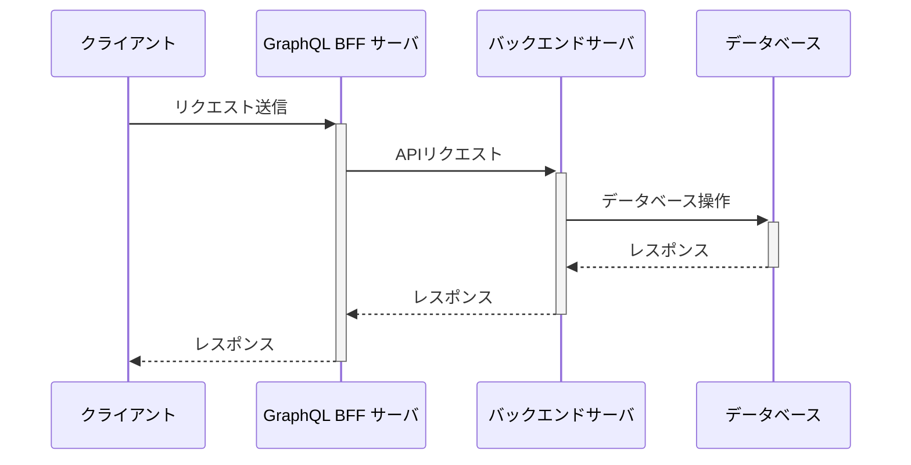

# Data Loader

# 環境構築

[前提となる環境構築](../00.環境構築/README.md)が完了している前提

## BFF

1. 依存関係のインストール

```sh
# リポジトリルートから
cd 03.bff+backend/bff
nvm use # .npmrc
corepack enable pnpm
pnpm -v # 9.4.0
pnpm i
```

2. バックエンドのプロキシコード生成

```sh
# リポジトリルートから
cd 03.bff+backend/backend
# 別ターミナルでバックエンドのサーバを起動している状態で(起動方法は以下参照)
./gradlew openApiClean openApiGenerate
```

## バックエンド

前提の環境構築が完了していれば特になし。

# サーバ起動

## BFF

```sh
# リポジトリルートから
cd 03.bff+backend/bff
pnpm start:dev
```

## バックエンド

```sh
cd 03.bff+backend/backend
./gradlew bootRun
```

# 前提情報

## システム構成/APIリクエストシーケンス

localhost:3000にBFFサーバ、localhost:8080にバックエンドサーバがアップしており、以下のシーケンスでリクエストをします。



## 各エンドポイントの状況

### BFF

`http://localhost:3000/graphql`をブラウザで開くことでクエリのエディタが表示されます。

`http://localhost:3000/graphql-view`にアクセスすることでビジュアルにノード間の関係性を確認できます。

### バックエンド

`http://localhost:8080/swagger-ui/index.html#/`にアクセスすることでバックエンドの各エンドポイント情報を確認できます。

# 前回のおさらい

# N + 1問題

# Dataloaderという解決策

# コード例

`bff/src/graphql/user/user.resolver.ts`

# 参考文献

https://qiita.com/nakawodayo/items/2f2f98c9833659da66f0